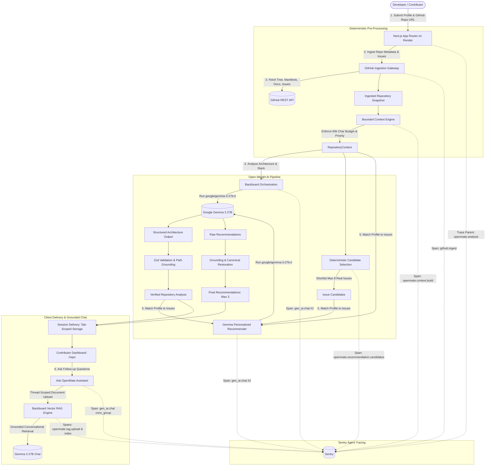

# OpenMate

> **Your first contribution starts here.**  
> Deterministic open-source contributor onboarding powered by Google Gemma 3 27B, Backboard, Render, and Sentry Agent Tracing.

[](https://github.com/Ismailco/OpenMate/actions/workflows/ci.yml)
[](https://openmate-zq7d.onrender.com)
[](LICENSE)

OpenMate helps developers find and make their first meaningful open-source contribution. By combining developer profiles, bounded repository context extraction, and **Google Gemma 3 27B** open-weight AI reasoning, OpenMate analyzes public GitHub repositories and recommends well-matched issues with concrete, actionable onboarding plans.

🔗 **Live Production Demo**: [https://openmate-zq7d.onrender.com](https://openmate-zq7d.onrender.com)  
🩺 **Production Health**: [https://openmate-zq7d.onrender.com/api/health](https://openmate-zq7d.onrender.com/api/health)

---

## The Problem

Every developer remembers trying to make their first open-source contribution. The barrier is almost never the code itself—it is **repository scale and architectural friction**:

* **Massive Codebases**: Navigating hundreds of source files and complex directory structures without knowing which files actually matter.
* **Issue Overload**: Sorting through hundreds of open issues where even those labeled `good first issue` often assume intimate monorepo familiarity.
* **Unclear Entrypoints**: Spending hours guessing where to safely insert the first change without breaking existing patterns.
* **Contribution Anxiety**: Uncertainty over whether an issue requires two hours or two weeks, leading many aspiring contributors to abandon the attempt.

OpenMate eliminates this friction by matching a contributor's declared skills and available time with real open issues, explaining *why* they fit, and pointing directly to the first files to read.

---

## What OpenMate Does

1. **Developer Profile Capture**: Contributor declares their primary/secondary technologies, contribution focus (frontend, backend, devtools, docs), available hours, and experience level.
2. **Secure Repository Ingestion**: Ingests public GitHub repositories with strict SSRF controls, path traversal filtering, and file tree bounds.
3. **Bounded Context Engine**: Assembles a deterministic 60,000-character context snapshot prioritizing documentation, dependency manifests, entrypoints, and open issues.
4. **Google Gemma 3 27B Architecture Analysis**: Extracts architectural subsystems, core technologies, and recommended files to understand.
5. **Deterministic Issue Candidate Selection**: Pre-filters and scores all open issues before any AI call, producing a focused shortlist of at most 8 real GitHub issues.
6. **Personalized Contribution Recommendations**: Gemma evaluates the candidate issues against the developer profile, producing "Your First Contribution"—a primary recommendation with fit reasoning, scope estimation, entrypoint files, and investigation steps.
7. **Ask OpenMate (Thread-Scoped RAG)**: Provides an interactive follow-up chat powered by Backboard vector RAG and Gemma 3 27B, allowing contributors to ask questions grounded strictly in the repository context.

---

## Technical Architecture



For in-depth architectural specifications and component boundaries, see [docs/architecture.md](docs/architecture.md).

---

## Open-Weight AI (Google Gemma 3 27B)

OpenMate is powered by **Google Gemma 3 27B** (`google/gemma-3-27b-it`), an open-weight instruction-tuned model with a 131,072-token context window.

* **Open Weights**: The core reasoning engine is open-weight, ensuring transparency, auditability, and independence from proprietary closed APIs.
* **Separation of Concerns**: Gemma handles high-level cognitive tasks (architectural understanding, issue fit synthesis, actionable starting steps). Deterministic software owns issue numbers, canonical URLs, and file existence checks.
* **Zero Proprietary Fallback**: OpenMate operates strictly on Gemma open weights with no fallback to closed proprietary models.

---

## Backboard

OpenMate uses **Backboard** for model orchestration and vector retrieval:
* **Structured Inference**: Manages low-latency access to Gemma 3 27B with temperature control and schema validation.
* **Thread-Scoped Vector RAG**: Ingests repository context documents into an ephemeral vector collection (`gemini-embedding-001-1536`, `top_k = 8`) to power the Ask OpenMate assistant.
* **Memory Intentionally OFF**: Persistent memory is explicitly disabled (`memory = false`) because OpenMate has no authenticated durable user identities. This guarantees zero cross-session data leakage and complete contributor privacy.

---

## Render

OpenMate runs in production as a Node web service on **Render**:
* **Server-Side Security**: Render hosts the full Next.js 16 runtime, ensuring that `BACKBOARD_API_KEY`, `GITHUB_TOKEN`, and `OPENMATE_CHAT_SIGNING_SECRET` remain strictly server-side and invisible to browsers.
* **Continuous Deployment**: Automated zero-downtime builds triggered from GitHub `main` after CI quality gates pass.
* **Production Health Probes**: Real-time health monitoring via `GET /api/health` verifying commit revisions.

---

## Sentry Agent Tracing & Observability

OpenMate instruments its generative AI workflows using **Sentry Agent Tracing** and OpenTelemetry `gen_ai.*` semantic conventions:

```text
openmate.analysis (Root trace: 48.55s)
├── github.ingest (~1.82s)
├── openmate.context.build (~0.08s)
├── gen_ai.chat [Gemma repository analysis] (~23.40s)
├── openmate.recommendation.candidates (~0.02s)
└── gen_ai.chat [Gemma recommendations] (~22.85s)

openmate.chat.init (Chat initialization: 8.35s)
├── github.ingest
├── openmate.context.build
├── openmate.rag.upload (~0.30s)
└── openmate.rag.index (~7.10s)

gen_ai.chat [Ask OpenMate turns] (3.30s – 5.86s)
└── Grouped by conv_<sha256(threadId)>
```

### Key Production Trace Findings
* **Model Inference Dominates**: Real production measurements show that **~96% of total analysis latency** is spent in Gemma's multi-step reasoning (~46.25s), while deterministic ingestion and candidate selection take **under 4%** (~1.92s).
* **RAG Retrieval Acceleration**: Pre-indexing the repository during chat initialization (8.35s) enables subsequent conversational queries to resolve in **3.30s–5.86s**, an **8x–14x speedup** over full re-analysis.
* **Privacy-First Telemetry**: Span attributes record counts and status codes only. Sentry `beforeSend` and `beforeSendSpan` scrub all source code, issue text, prompt bodies, model completions, and raw Backboard thread IDs.

---

## Security & Invariants

OpenMate is engineered with security and grounding as first-class constraints:
* **SSRF Defense**: Strictly validates repository URLs against `github.com`; blocks loopback, private subnets, and non-HTTPS protocols.
* **Bounded Ingestion**: Caps repository tree parsing to 500 entries, issues to 100, and context size to 60,000 characters.
* **Prompt Injection Containment**: Separates system instructions from untrusted repository text with security boundaries.
* **Canonical Issue Identity**: Gemma cannot invent issue numbers or URLs; canonical identities are deterministically restored from GitHub data.
* **Path Verification**: Hallucinated file paths are matched and removed against genuine repository context paths.
* **Signed Conversation Tokens**: Browser chat sessions use HMAC-SHA256 tokens; no provider credentials or thread IDs are exposed to the client.
* **Strict CSP & Headers**: Deployed with Content Security Policy, strict origin referrer policy, and frame protection.

For the complete security threat model and mitigation matrix, see [docs/security.md](docs/security.md).

---

## Getting Started

### Prerequisites
* Node.js >= 22.x
* pnpm >= 11.x (`pnpm@11.7.0` pinned in `packageManager`)

### Installation & Local Setup

```bash
# Clone the repository
git clone https://github.com/Ismailco/OpenMate.git
cd OpenMate

# Install dependencies strictly from lockfile
pnpm install --frozen-lockfile

# Configure environment variables
cp .env.example .env.local
```

### Environment Variables

Configure `.env.local` with the following:

```bash
# GitHub Access Token (optional for public repositories, increases rate limits)
GITHUB_TOKEN=

# Backboard API Key for Gemma repository reasoning
BACKBOARD_API_KEY=

# Gemma model configuration (default: google/gemma-3-27b-it via openrouter)
BACKBOARD_MODEL_PROVIDER=openrouter
BACKBOARD_MODEL_NAME=google/gemma-3-27b-it
BACKBOARD_TIMEOUT_MS=60000

# Chat conversation token HMAC secret (minimum 32 characters)
OPENMATE_CHAT_SIGNING_SECRET=

# Sentry Observability (optional for local development)
SENTRY_DSN=
SENTRY_ENVIRONMENT=development
SENTRY_TRACES_SAMPLE_RATE=1.0
```

### Development Scripts

```bash
pnpm dev                 # Run local Next.js development server
pnpm backboard:models    # Query available Gemma models via Backboard
```

---

## Testing & Quality Gates

OpenMate maintains an automated multi-tier testing pipeline. **All automated tests run completely offline** with zero external network calls. No live credentials or API keys are required to run tests.

```bash
# Run unit & integration test suite (Vitest)
pnpm test

# Run browser E2E test suite (Playwright against production Next.js build)
pnpm e2e

# Run complete quality validation gate
pnpm lint && pnpm typecheck && pnpm test && pnpm build && pnpm e2e && pnpm audit
```

* **Unit & Integration Suite (Vitest)**: 54 test files, 255 tests covering schemas, ingestion boundaries, candidate heuristics, RAG context formatting, HMAC token signing, and Sentry privacy sanitization.
* **Browser E2E Suite (Playwright)**: 14 scenarios testing full onboarding navigation, results rendering, chat lifecycle, error recovery, mobile viewports, and XSS neutralization against a live production build.
* **GitHub Actions CI**: Automated parallel Quality Gate and Browser E2E Gate on every push and pull request.

---

## Hacktoberfest 2026

This repository was created from scratch for the **[Hacktoberfest Weekend Challenge: Build for a Friend](https://dev.to/challenges/hacktoberfest-weekend-2026-10-01)** (October 2 to October 5, 2026).

* **Project Creation**: October 2, 2026 (`2026-10-02T11:43:52Z`)
* **Submission Deadline**: October 5, 2026 at 6:59 AM UTC
* **Repository Policy**: All hackathon submission implementation commits were completed within the challenge window before the contest submission deadline.

---

## License

This project is licensed under the MIT License - see the [LICENSE](LICENSE) file for details.
