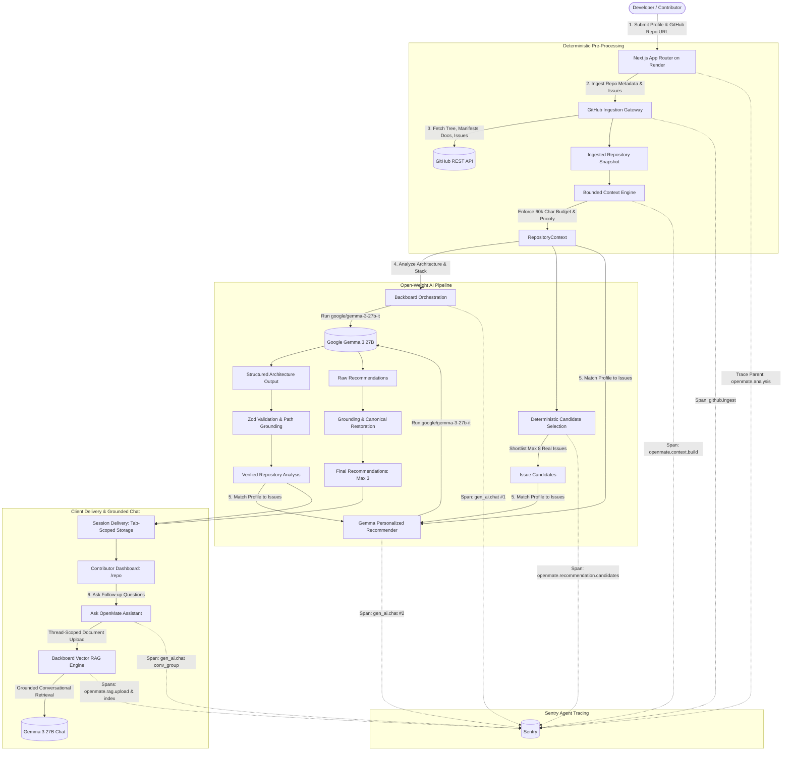

# OpenMate Technical Architecture

> Deterministic open-source contributor onboarding powered by Google Gemma 3 27B and Backboard orchestration.

---

## 1. System Architecture Overview

OpenMate bridges the gap between an unfamiliar open-source codebase and a new contributor by pairing **deterministic software boundaries** with **open-weight generative AI reasoning**.

---

## 2. Core Architectural Principles

### A. Separation of Deterministic Engineering and AI Reasoning
* **Deterministic Ownership**: OpenMate's software controls repository URLs, canonical issue numbers, issue titles, issue URLs, user declared skills, and file path verification. Gemma is never permitted to invent issue numbers or fabricate project files.
* **AI Ownership**: Gemma 3 27B (`google/gemma-3-27b-it`) is responsible for high-level repository comprehension, identifying architectural subsystems, explaining contribution culture, evaluating contributor fit, and generating actionable starting investigation steps.

### B. Single-Pass Pipeline
To eliminate redundant network I/O and expensive multi-turn LLM context preparation, `POST /api/repositories/analyze` executes a single-pass workflow:
1. Ingest repository metadata, directory tree, entrypoint files, documentation, and open issues once.
2. Build the bounded `RepositoryContext` once.
3. Execute Gemma repository analysis once.
4. Deterministically filter and rank open issues into a candidate shortlist ($\le 8$ issues).
5. Execute Gemma personalized matching once across the shortlist.
6. Assemble the unified response payload and return it to the client.

### C. Privacy-First Ephemeral State
* **No Authentication / Database Needed**: OpenMate stores contributor dashboard results in browser `sessionStorage` (`openmate.analysis.v1`) scoped to the active tab. Sensitive credentials and raw repository dumps are never saved client-side.
* **Stateless Backend**: The Render Node service persists no user profiles or repository source code.
* **HMAC-SHA256 Conversation Tokens**: Interactive Ask OpenMate chat sessions are secured using signed tokens containing the ephemeral Backboard assistant and thread IDs. Clients receive no provider credentials.

---

## 3. Detailed Component Breakdown

### 1. GitHub Ingestion Layer (`src/features/github/`)
* **Host Restriction**: Only `github.com` repositories are accepted.
* **SSRF Defense**: Prevents requests to loopback (`127.0.0.1`, `localhost`), private RFC 1918 subnets, link-local addresses, and non-HTTPS protocols.
* **Path Traversal Protection**: Rejects file paths containing `../` or encoded traversals.
* **Bounded Ingestion**: Ingests up to 100 open issues, inspects up to 500 repository tree entries, and skips binary, minified, or lockfile artifacts.

### 2. Deterministic Context Engine (`src/features/repository-context/`)
* **Budget Enforcement**: Hard ceiling of 60,000 characters to ensure predictable latency and preserve ample token headroom for reasoning.
* **Content Prioritization**: Prioritizes `README.md`, `CONTRIBUTING.md`, package manifests (`package.json`, `Cargo.toml`, `pyproject.toml`), directory structures, entrypoint source files, and open issue descriptions.
* **Untrusted Content Encapsulation**: Repository content is framed with explicit untrusted boundaries to neutralize prompt injections.

### 3. Google Gemma 3 27B Analysis (`src/features/repository-analysis/`)
* **Model**: `google/gemma-3-27b-it` (Google Gemma 3 Instruction-tuned, 27B parameters, 131k token context window).
* **Backboard Orchestration**: Manages model connectivity, parameters (`temperature = 0.2` for structured extraction), and streaming/json response handling.
* **Deterministic Filtering**:
  * Hallucinated file paths are matched against real repository context paths; invalid paths are scrubbed.
  * Zod schema parsing enforces strict type conformance with automatic repair fallback if formatting fails.

### 4. Deterministic Candidate Selection (`src/features/contribution-recommendations/candidate-selector.ts`)
Before invoking Gemma for personalized recommendations, OpenMate filters open issues deterministically:
* Scores issues using beginner-friendly labels (`good first issue`, `good-first-issue`, `help wanted`, `beginner-friendly`, `documentation`).
* Matches issue title and body keywords against the contributor's declared interests (`frontend`, `backend`, `developer-tools`, `documentation`, `testing`, `performance`, `accessibility`, `devops`).
* Adjusts score by experience level (`first-time`, `some-experience`, `experienced`).
* Selects a focused shortlist of at most 8 candidate issues to present to Gemma.

### 5. Gemma Recommendation Reasoning (`src/features/contribution-recommendations/`)
* Gemma evaluates the contributor profile against the 8 shortlisted candidate issues.
* Computes fit scores, explains matching reasoning based on specific developer skills, classifies implementation scope (`small`, `medium`, `large`), and suggests concrete first steps and caveats.
* **Grounding Restoration**: OpenMate restores the canonical GitHub issue title, URL, and issue number from the verified GitHub ingestion data.

### 6. Ask OpenMate Conversational RAG (`src/features/repository-assistant/`)
* **Thread-Scoped RAG**: Bounded repository context is serialized into a temporary markdown document and uploaded to Backboard's vector retrieval system (`gemini-embedding-001-1536`, `top_k = 8`).
* **Memory Intentionally Disabled**: Persistent memory is turned off (`memory = false`) because OpenMate has no authenticated durable user identities. Each conversation is self-contained.
* **Web Search Off**: Disabled to ensure responses are strictly grounded in the repository context.
* **No Executable Tools**: The assistant cannot execute code or access host resources.

### 7. Sentry Production Observability (`src/features/observability/`)
* **Full Waterfall Trace**: Root span `openmate.analysis` tracks end-to-end execution, decomposing latency into `github.ingest`, `openmate.context.build`, `gen_ai.chat` (repository analysis), `openmate.recommendation.candidates`, and `gen_ai.chat` (recommendations).
* **AI Conventions**: OpenTelemetry `gen_ai.*` standard attributes (`gen_ai.operation.name`, `gen_ai.request.model`, `gen_ai.response.model`, `gen_ai.system`, `gen_ai.conversation.id`).
* **Safe Conversation Identity**: Chat turns are linked via deterministic one-way hashing: `conv_<sha256(threadId)>`.
* **Privacy Controls**: Zero source code, secrets, prompts, responses, or issue text in span attributes. Metadata only.
